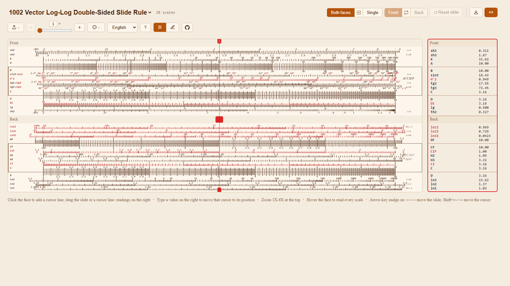
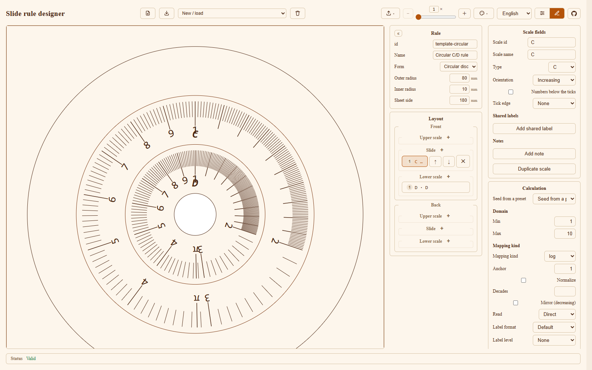

# OpenSlideRule

OpenSlideRule is a web simulator and authoring tool for slide rules. It ships with
the Chinese 1002 vector log-log double-sided rule (1002 型矢量重对数双面计算尺)
and the Type 57 pocket rule, and it can load or design any rule described by a
`RuleDefinition` JSON - straight or circular (disc). Values are obtained the way
they are on the physical instrument, by sliding and aligning rather than typing a
sum, and the built-in designer turns the same renderer into a rule-authoring
tool. It is for anyone who wants to read and operate a rule - students and
teachers of slide rules, collectors - and for anyone who wants to author and
preview one of their own.





## Try it / run locally

A GitHub Pages deployment is defined in
[`.github/workflows/deploy.yml`](.github/workflows/deploy.yml); pushing to
`master` or `main` builds and publishes the app. To run it locally:

```bash
npm install
npm run dev
```

Then open <http://localhost:3000> (Vite opens it for you). Node.js 20.19.4 or
newer is required.

## What you can do

**Simulator**

- Pick the model from the title selector: the 1002, the single-faced Type 57
  pocket rule, or a rule you imported.
- View one face at a time or both faces together (dual face); the Type 57 is
  single-faced.
- Drag the slide (or rotate the rotor of a circular rule) and reset it to the
  aligned position.
- Work with several cursors: click the rule to add one, drag one to move it, or
  type a value in the readings panel to move it to the position that reads that
  value.
- Hover anywhere on the rule for a live read-out of every scale under the
  pointer.
- Read every scale at each cursor in the readings panel, and edit a reading to
  move its cursor.
- Zoom from 1X to 6X.
- Choose from six themes (plastic, bamboo, contrast, aluminum, ivory,
  blueprint); a theme also restyles the surrounding interface.
- Switch the interface language between Simplified Chinese (zh-CN) and English
  (en-US).
- Export the current view as PNG or SVG, or export the operation history as
  Markdown.
- Print or save to PDF at 1:1 scale.
- Take the first-run tutorial, and open the model-information dialog for the
  dimensions, scales and parts of the current rule.

**Rule designer**

- Seed from a built-in model or start from a starter template (a linear log rule
  or a circular C/D rule).
- Edit the rule metadata, the linear layout (face size, rows, gutters) or the
  disc dimensions of a circular rule.
- Add, reorder and remove scales; edit each scale's fields and its calculations.
- Preview the result live through the same renderer the simulator uses.
- Select a scale by clicking it in the preview or in the list.
- Watch the validation status bar and export a draft as `<id>.spec.json` or a
  finished rule definition as `<id>.rule.json`.

## Load your own rule

Use the **Import** button in the toolbar, or drop a `.json` file onto the
simulator view. The file must be a `RuleDefinition` - the same schema the
designer and the generator produce. A malformed, invalid or unsupported file is
reported without disturbing the current view. Circular rules are supported as
well as linear ones.

## Learn more

The [user guide](docs/guide/README.md) explains how to use the app. For the
physical instrument, see [how slide rules work](docs/domain/slide-rule-101.md)
and the [1002 model](docs/domain/model-1002.md); the
[glossary](docs/glossary.md) collects the terminology. The
[documentation index](docs/README.md) lists everything. Developers should start
with [docs/dev/](docs/dev/) and [CONTRIBUTING.md](CONTRIBUTING.md).

## How this was built

This project was developed by **vibe coding**: nearly all of the code was
written in AI-assisted, prompt-driven sessions, with a human directing the work,
checking the results and curating the data. The measured rule data and the domain
notes were verified against the prototype photographs, but the codebase as a
whole has not had the sustained human review a project of this size would
normally receive.

If you contribute to or reuse this project, please keep that in mind: read the
code before trusting it, run the tests, and expect rough edges. Corrections and
hardening are welcome.

## Licence

GNU General Public License v3.0 - see [LICENSE](LICENSE).
