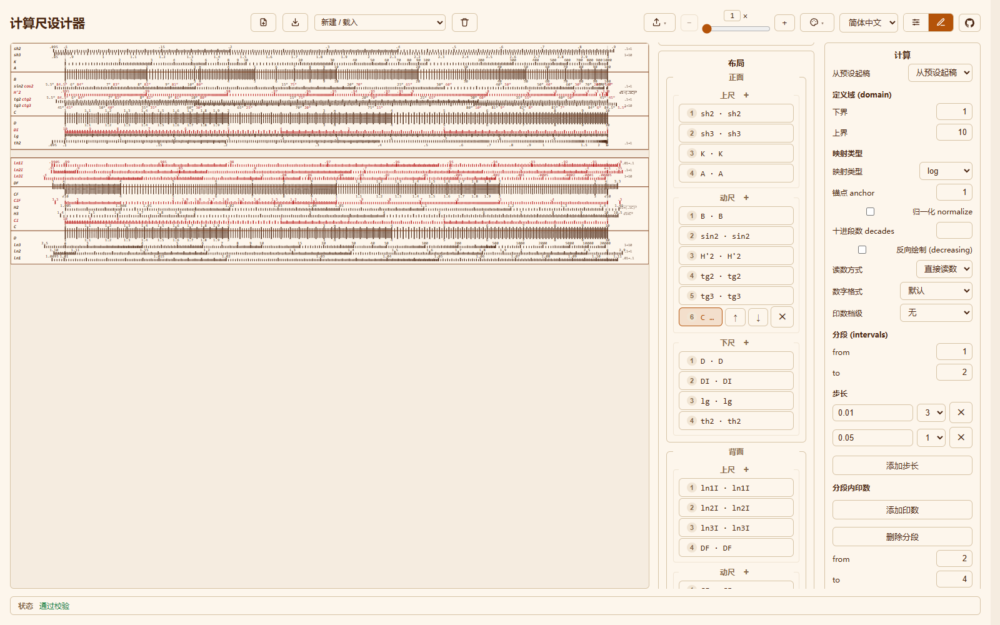
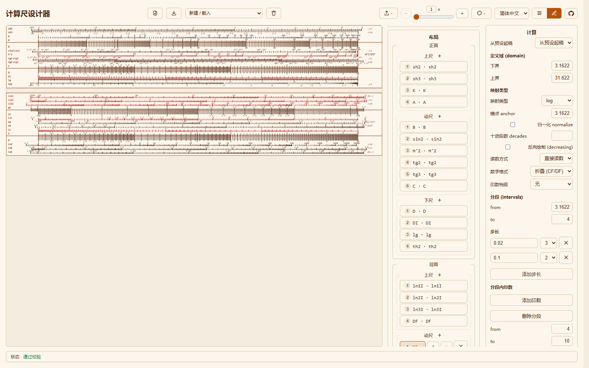
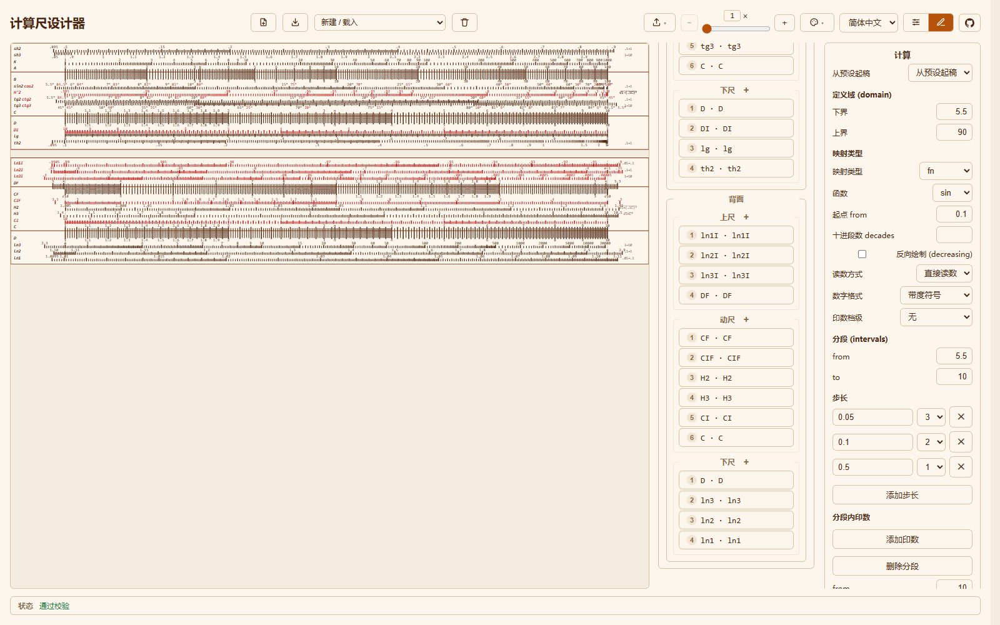
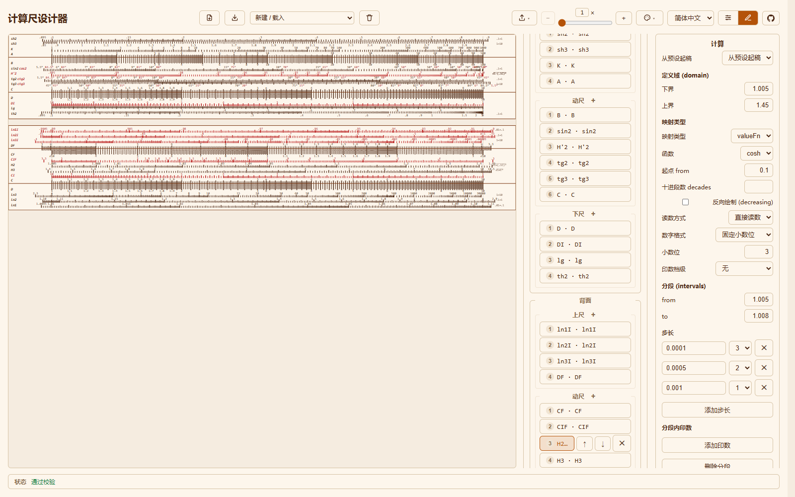
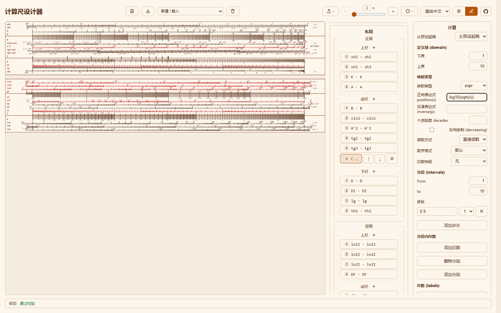

# 设计器计算：实例详解

设计器最让人犯难的地方，几乎都集中在一个面板里。一条标尺不只是它的名字和它的那一行：在其背后，有一条规则把「值」变成纸面上的「位置」，而这个规则就是 **计算（Calculation）** 面板。本页用应用自带真实标尺来讲解它——读者可以照抄一个例子，改一个字段，看会发生什么。若还没打开过设计器，请先读[设计器](designer-cn.md)；本页假设读者已经能选中一条标尺并看到它的**计算**面板。

每一节末尾都有一个**原理**小框，把例子提升为一般规则。原理刻意写短，例子才是重点。

## 五个概念

整个模型由五个词撑起：

- **值（value）**：标尺度量的对象，如 `2`、`3.5`、`45`。
- **位置（position）**：该值落在标尺上的位置。最左为 `0`、最右为 `1`，之后渲染器再把它拉伸到毫米。
- **映射（mapping）**：把值变成位置的公式，`p = f(x)`。
- **分段（interval）**：刻度网格的一段实测区间；段内的每个**步长（step）**规定这段分得多细、刻度多重（档级 1、2、3）。
- **印数（label）**是印在刻度上的数字；**记号（mark）**是额外标注的点，不必落在网格上（`π`、`√10`、`∞`）。

面板里其余的，是**定义域（domain）**（这条标尺覆盖的值范围）和**读数**一侧（把位置反算回值）。

## log —— 乘法标尺（C、D）

**要做的标尺：** 一把 1 到 10 的 `C` 尺。

打开 **新建 / 载入 -> 内置型号 -> 1002**，然后在**布局**里展开**正面 -> 动尺**，选中 `C`。**计算**面板显示：

| 字段 | 取值 |
|---|---|
| 定义域 | `1` .. `10` |
| 映射类型 | `log` |
| 锚点 anchor | `1` |
| 归一化 normalize | 关 |

**会画出什么。** 数字 1 到 10，且等**比例**对应等距离：1 到 2 的间距与 5 到 10 的间距相同。这正是计算尺的意义——加上一段长度，就是做乘法。

**原理。** 映射是 `p = log10(值 / 锚点)`。锚点为 1 时即 `p = log10(值)`，定义域 `1..10` 正好落在位置 `0..1`。1002 的 `C` 还带有实测的分段网格（靠近 1 更细、靠近 10 更粗），让画出的刻度与实物一致。

## 带偏移锚点的 log —— 折叠尺（CF、DF）

**要做的标尺：** `CF`，一把以 `√10` 折叠的 `C` 尺，与 `D` 配合可不动动尺做乘法。

选中内置型号的 `CF`（在**背面 -> 动尺**）：

| 字段 | 取值 |
|---|---|
| 定义域 | `3.1623` .. `31.6223` |
| 映射类型 | `log` |
| 锚点 anchor | `3.1623` |
| 数字格式 | `折叠 (CF/DF)` |

**会画出什么。** 一把*看起来*像 `C`（印数 1 到 10）但整体偏移半个十进段的标尺，`√10` 记号落在折叠处。这里的 `√10` 是一个**记号**，不是刻度。

**原理。** 锚点移动了对数的原点。`p = log10(x / √10)` 把定义域 `√10..10√10` 映射到 `0..1`。`折叠` 数字格式去掉十位，于是值 `31.62` 印成 `3.16`。只要一条 log 标尺的起点不是 1，就一定有锚点在起作用。

## linear —— L / lg 尺

**要做的标尺：** `L` 行，计算尺上那把普通直尺。

选中内置型号的 `lg`（在**正面 -> 下尺**）：

| 字段 | 取值 |
|---|---|
| 定义域 | `0` .. `1` |
| 映射类型 | `linear` |
| 数字格式 | `线性分数 (L)` |

**会画出什么。** 等差值对应等距离——是直尺，不是对数尺。在计算尺上，线性 `L` 行读的是对数的尾数：把 `D` 上的数对齐，游标下的 `L` 行就给出它的 `log10`。

**原理。** `linear` 没有任何字段。凡是要「成比例」的标尺（普通直尺、温度尺）就用它；凡是要求「等比例对应等距离」就用 `log`。类型（`L`、`lg`）只是命名家族，几何由映射决定。

## fn —— 函数标尺（sin2、tg2、sinh、ln……）

**要做的标尺：** `sin2`，与动尺配合使用的正弦尺。

选中内置型号的 `sin2`（在**正面 -> 动尺**）：

| 字段 | 取值 |
|---|---|
| 定义域 | `5.5` .. `90` |
| 映射类型 | `fn` |
| 函数 | `sin` |
| 起点 from | `0.1` |
| 数字格式 | `带度符号` |

**会画出什么。** 一把从 5.5 到 90 度、间距为正弦之对数的标尺。它右侧的**说明注释**印着 `√1-(.1C)²`，即这一行配合使用的修正。

**原理。** `fn` 计算 `p = log10(fn(值) / 起点)`。先对值施加函数（`sin`、`tan`、`ln`、`sinh`、`tanh`），再除以**起点**——一个把结果拉回合适十进段的参考值。自带规则对同族的第一行用 `from = 0.1`、下一行用 `from = 1`（如 `sh2`/`sh3`、`ln2`/`ln3`），这样各行能整齐叠放。

## valueFn —— 双曲行（H2、H3、H'2）

**要做的标尺：** `H2`，一条 cosh 行。

选中内置型号的 `H2`（在**背面 -> 动尺**）：

| 字段 | 取值 |
|---|---|
| 定义域 | `1.005` .. `1.45` |
| 映射类型 | `valueFn` |
| 函数 | `cosh` |
| 起点 from | `0.1` |

**会画出什么。** 一行印数是 `cosh` 值的标尺，但它的*间距*来自底层的自变量。

**原理。** `valueFn` 用于「印出来的值不是被定位的那个量」的情形。印数是 `V = cosh(u)`，而位置用的是自变量 `u`：`cosh` 为 `p = log10(sqrt(V² − 1) / 起点)`，`sech` 为 `p = log10(sqrt(1 − V²) / 起点)`。1002 用 `cosh` 画 `H2` / `H3`，用 `sech` 画 `H'2`。只有当「印的数是被定位量的函数」时才选 `valueFn`。

## expr —— 任意公式（逃生舱）

**要做的标尺：** 与 `C` 同样的形状，但刻度来自读者自己输入的公式。

载入内置型号、选中 `C`，然后在**计算**里选 **从预设起稿 -> expr**，输入公式：

| 字段 | 取值 |
|---|---|
| 定义域 | `1` .. `10` |
| 映射类型 | `expr` |
| 正向表达式 `position(x)` | `log10(sqrt(x))` |
| 反演表达式 `inverse(p)` | *（留空）* |

**会画出什么。** 一把位置完全按读者公式走的标尺。这里 `log10(sqrt(x))` 是 `log10(x)` 的一半，于是标尺只占半个十进段——结果独特、一眼可辨。由于 `inverse(p)` 留空，读数时应用会对正向公式做数值反演。

**原理。** `expr` 是四种声明式映射表达不了时的逃生舱。`position(x)` 必填，且必须在定义域上**严格单调**（校验器会采样 33 个点）；`inverse(p)` 可选，给出时是精确的。表达式语言是安全的——不用 `eval`、函数白名单固定、只允许 `x` / `p`、`pi`、`e`——完整规则见[表达式](../dev/expressions-cn.md)。先用预设起稿，它会给出一个粗网格供读者细化。

## 分段与步长 —— 网格有多细

**分段（interval）**是刻度网格的一段；一条标尺的网格就是它的分段清单。每段里有一个或多个**步长（step）**，每个步长＝一个尺寸＋一个**档级**（1 主、2 中、3 细）。

要看效果，把 `C` 的实测网格换成教学用的：单个 `1 .. 10` 分段，两个步长——`1` 档级 1、`0.1` 档级 3。引擎把步长按尺寸排序、先画最细的；当较粗的步长落在细步长已画的刻度上时，**较粗的档级获胜**。于是读者得到 10 条重刻度（1、2……10）嵌在一层 0.1 的细网格里，而无需逐条列出。

**原理。** 真实标尺会用多个分段，因为合适的步长随定义域变化：`C` 在 1 到 2 之间最细的步长是 `0.01`，靠近 10 时则粗好几倍，因此整个十进段内网格都保持清晰。**分段内印数**能在某段里额外印数字而不加步长；**十进段数 decades** 会把整套分段模式沿十倍方向重复（1002 的 `A` 用 2、`K` 用 3，并开启**归一化**把每段重复拉伸到满宽）。

## 印数、记号与注释 —— 三种「印出来的东西」

三者容易混淆，务必分清：

- **印数（label）**落在刻度网格*上*。填一个**值**，可选填**文本**；有文本就印文本而非数字。
- **记号（mark）**是标注点，*不必*落在网格上。1002 在 `C` / `D` / `A` / `B` / `DF` 上印 `π`、在 `CF` 上印 `√10`、在 `th2` 末端印 `∞`——它们都是记号。勾选**无穷大 ∞** 可把记号放到渐近线上。
- **说明注释（note）**是印在尺面右侧的自由文本：`A` 行的 `x²`、`DI` 的 `1/x`，以及双曲行上红/黑相间的参考注释。一条注释由若干**片段**组成，每段可标**红色**。

**原理。** 印数与记号都是*位置*，都会扩展标尺的印刷范围，所以略微超出映射定义域的值依然可读。而注释不携带任何位置，它只是参考文本。拿不准用哪个时，问一句：这东西在尺上有位置吗？有就是印数或记号，没有就是注释。

## 共享计算及其陷阱

一条计算可以从标尺里抽出，成为具名条目供多条标尺复用。在 JSON 里它是一个 `calculations` 映射，加上一条用 `{ "ref": "<名字>" }` 指向它的标尺；生成器在构建成品规则时会把引用内联展开。选中这样一条标尺时，面板会提醒读者：

> 该计算为命名引用 `<名字>`，编辑将影响所有共享它的标尺。

**陷阱：** 印数、记号与分段都挂在*计算*上，因此也会一并共享。两条共享同一计算的标尺会共享**每一个**记号——若希望其中一条印 `π`、另一条不印，它们就不能共享。自带型号与起步模板都把自己的计算内联，因此从不共享；只有用生成器库编写的 spec 才会。

## 速查表

| 映射类型 | 字段 | 位置公式 | 真实样例 |
|---|---|---|---|
| `log` | 锚点、归一化 | `log10(x / anchor)` | `C`、`D`、`A`、`B`、`K`、`CF`、`DF`、`CI`、`DI`、`CIF` |
| `linear` | （无） | 定义域内成比例 | `L`、`lg` |
| `fn` | 函数、起点 | `log10(fn(x) / from)` | `sin2`、`tg2`、`tg3`、`sh2`、`sh3`、`ln1`..`ln3`、`th2` |
| `valueFn` | 函数、起点 | `log10(sqrt(V² ± 1) / from)` | `H2`、`H3`（`cosh`）、`H'2`（`sech`） |
| `expr` | position(x)、inverse(p) | 读者的公式 | 其余一切 |

读数与绘制彼此独立、且永远不会打架：**读数方式**默认**直接读数**（用映射自身的反函数），或选**倒数**，即读 `n / 值`、系数为 `n`（`CIF` 用 10，镜像的 `ln*I` 族用 1）。要让一条标尺常规地「从大到小」，把**反向绘制**与**方向：递减（红色）**配对使用。

## 常见错误

- **分段落在定义域之外。** 步长只在两者重叠处生成；把分段移回定义域内。
- **多十进段的尺只画出一段。** 打开**归一化**并设置**十进段数**，否则模式不会重复。
- **该等比例的地方用了等差值。** 那是 `linear`；乘法标尺需要 `log`。
- **折叠行忘了改锚点。** `CF` / `DF` 以 `√10` 为锚点。
- **`expr` 公式不单调。** 校验会拒绝；请选在定义域上只升或只降的公式。

## 接下来

- [设计器](designer-cn.md)——每个面板与字段的完整参考。
- [如何读尺](reading-scales-cn.md)——位置如何变成读数。
- [表达式](../dev/expressions-cn.md)——`expr` 语言全解。
- [数据模型](../dev/data-model-cn.md)与[计算管线](../dev/calculation-pipeline-cn.md)——底层类型，面向开发者。
- [术语表](../glossary-cn.md)——项目术语：标尺、刻尺、印数、记号、分段、步长。
