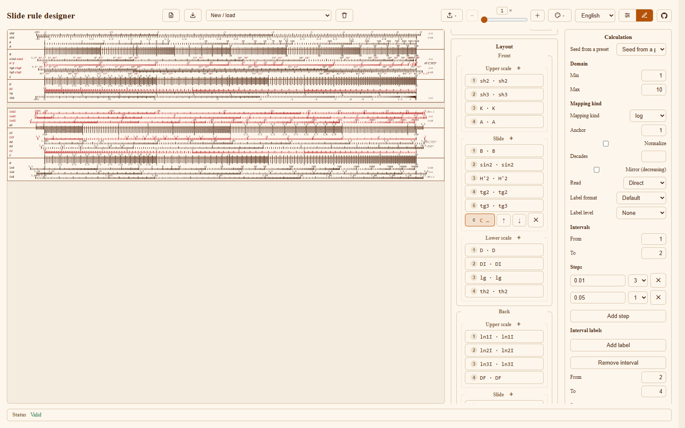
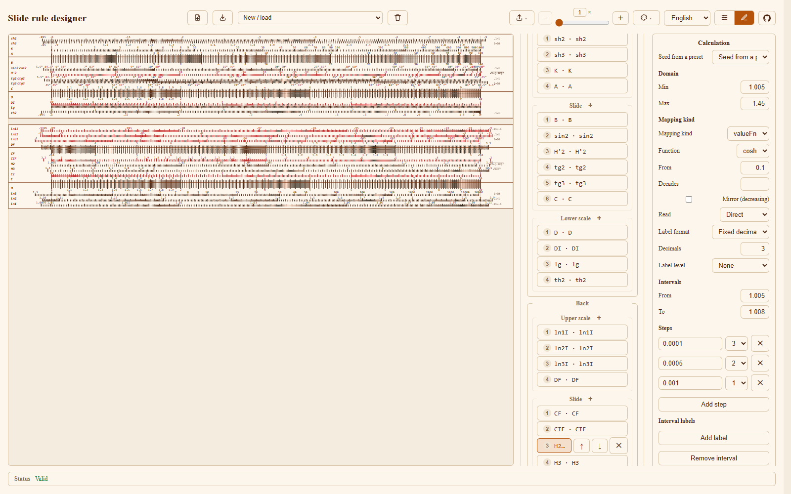
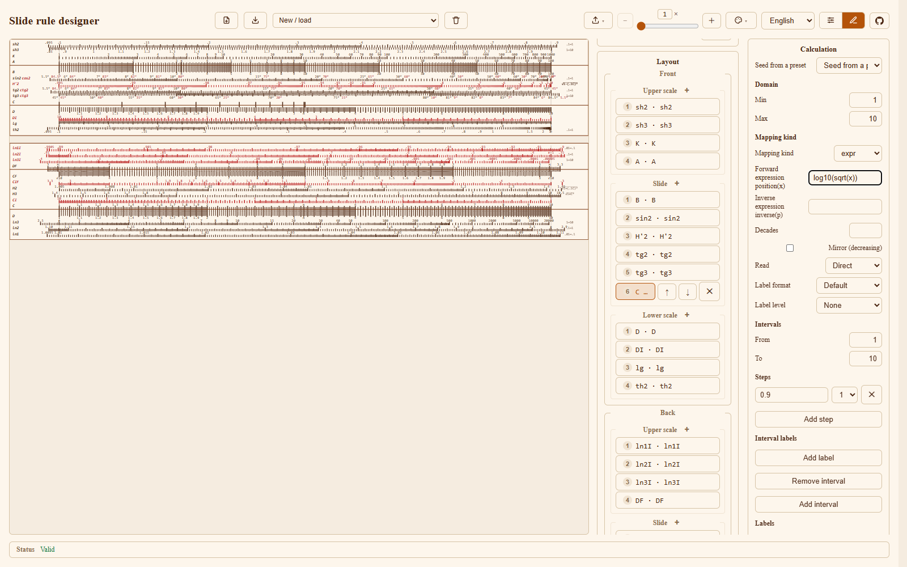

# Designer calculations, by example

Most of the designer's difficulty is in one panel. A scale is not just its name
and its row: underneath, a rule turns a value into a place on the paper, and
that rule is the **Calculation** panel. This page teaches it from real scales
that ship with the app, so you can copy an example, change one field and watch
what happens. If you have not opened the designer yet, read [Designer](designer.md)
first; this page assumes you can select a scale and see its **Calculation**
panel.

Every section below ends with a **Going further** box that turns the example
into the general rule. The theory is deliberately short; the examples are the
point.

## The five ideas

Five words carry the whole model:

- A **value** is what a scale measures: `2`, `3.5`, `45`.
- A **position** is where that value sits across the scale, from `0` at the left
  to `1` at the right, before the renderer stretches it to millimetres.
- A **mapping** is the formula that turns a value into a position, `p = f(x)`.
- An **interval** is one measured stretch of the graduation grid; each **step**
  inside it says how finely to divide that stretch and how heavy the tick is
  (level 1, 2 or 3).
- A **label** is a number printed at a graduation; a **mark** is an extra
  labelled point that need not fall on the grid (`π`, `√10`, `∞`).

The rest of the panel is the **domain** (the range of values the scale covers)
and the **reading** side (how a position is turned back into a value).

## log - the multiplication scale (C, D)

**The scale:** a `C` scale from 1 to 10.

Open **New / load -> Built-in models -> 1002**, then in **Layout** open
**Front -> Slide** and select `C`. The **Calculation** panel reads:

| Field | Value |
|---|---|
| Domain | `1` .. `10` |
| Mapping kind | `log` |
| Anchor | `1` |
| Normalize | off |

**What you get.** The numbers 1 to 10, spaced so that equal *ratios* are equal
distances: the gap from 1 to 2 is the same as the gap from 5 to 10. That is the
whole point of a slide rule - adding one length multiplies.

**Going further.** The mapping is `p = log10(value / anchor)`. With `anchor = 1`
this is `p = log10(value)`, so the domain `1..10` lands on positions `0..1`. The
1002's `C` also carries a measured grid of intervals (fine near 1, coarser near
10) so the printed graduations match the physical rule.

## log with a shifted anchor - the folded scale (CF, DF)

**The scale:** `CF`, a `C` scale folded at `√10`, so it can be used with `D` to
multiply without moving the slide.

Select the built-in's `CF` (in **Back -> Slide**):

| Field | Value |
|---|---|
| Domain | `3.1623` .. `31.6223` |
| Mapping kind | `log` |
| Anchor | `3.1623` |
| Label format | `Folded (CF/DF)` |

**What you get.** A scale that *looks* like `C` (labels 1 to 10) but is shifted
half a decade, with the `√10` mark sitting at the fold. The `√10` here is a
**mark**, not a graduation.

**Going further.** The anchor moves the origin of the log. `p = log10(x / √10)`
maps the domain `√10..10√10` to `0..1`. `Folded` label format drops the tens
digit, so the value `31.62` prints as `3.16`. Whenever a log scale starts
somewhere other than 1, an anchor is doing the shift.

## linear - the L / lg scale

**The scale:** the `L` row, the plain ruler along a slide rule.

Select the built-in's `lg` (in **Front -> Lower scale**):

| Field | Value |
|---|---|
| Domain | `0` .. `1` |
| Mapping kind | `linear` |
| Label format | `Linear fraction (L)` |

**What you get.** Equal distances for equal differences - a ruler, not a log
scale. On a slide rule the linear `L` row reads the mantissa of the log: line up
a number on `D` and the `L` row under the cursor gives its `log10`.

**Going further.** `linear` has no fields. Use it whenever the scale is
proportional (a plain ruler, a temperature scale), and `log` whenever equal
ratios must be equal distances. The type (`L`, `lg`) only names the family; the
mapping decides the geometry.

## fn - a function scale (sin2, tg2, sinh, ln ...)

**The scale:** `sin2`, the sine scale used with the slide.

Select the built-in's `sin2` (in **Front -> Slide**):

| Field | Value |
|---|---|
| Domain | `5.5` .. `90` |
| Mapping kind | `fn` |
| Function | `sin` |
| From | `0.1` |
| Label format | `With degree sign` |

**What you get.** A scale graduated in degrees from 5.5 to 90, where the
distance is the log of the sine. Its right-hand **Notes** read
`√1-(.1C)²`, the correction used with this row.

**Going further.** `fn` computes `p = log10(fn(value) / from)`. The function is
applied to the value first (`sin`, `tan`, `ln`, `sinh`, `tanh`), then divided by
**From**, a reference value that keeps the result in a comfortable decade. The
shipped rules use `from = 0.1` for the first row of a family and `from = 1` for
the next (for example `sh2`/`sh3`, `ln2`/`ln3`), so the rows stack neatly.

## valueFn - the hyperbolic rows (H2, H3, H'2)

**The scale:** `H2`, one of the cosh rows.

Select the built-in's `H2` (in **Back -> Slide**):

| Field | Value |
|---|---|
| Domain | `1.005` .. `1.45` |
| Mapping kind | `valueFn` |
| Function | `cosh` |
| From | `0.1` |

**What you get.** A row whose printed numbers are `cosh` values, but whose
*spacing* comes from the underlying argument.

**Going further.** `valueFn` is the case where the printed value is not the
mapped value. The label is `V = cosh(u)`, while the position uses the argument
`u`: `p = log10(sqrt(V² − 1) / from)` for `cosh`, and
`p = log10(sqrt(1 − V²) / from)` for `sech`. The 1002 uses `cosh` for `H2` /
`H3` and `sech` for `H'2`. Choose `valueFn` only when the numbers you print are
a function of the quantity you position.

## expr - any formula (the escape hatch)

**The scale:** the same `C` shape, but graduated from a formula you type.

Load the built-in, select `C`, then in **Calculation** choose **Seed from a
preset -> expr** and type a formula:

| Field | Value |
|---|---|
| Domain | `1` .. `10` |
| Mapping kind | `expr` |
| Forward expression `position(x)` | `log10(sqrt(x))` |
| Inverse expression `inverse(p)` | *(left empty)* |

**What you get.** A scale whose positions follow your formula. Here
`log10(sqrt(x))` is half of `log10(x)`, so the scale covers half a decade - a
distinctive, easy-to-see result. Because `inverse(p)` is left empty, the app
inverts the forward formula numerically when you read the scale.

**Going further.** `expr` is the opt-in escape hatch for a formula the four
declarative kinds cannot express. `position(x)` is required and must be
**strictly monotonic** over the domain (the validator samples 33 points);
`inverse(p)` is optional and, when given, is exact. The expression language is
safe - no `eval`, a fixed function whitelist, `x` / `p`, `pi` and `e` only - and
is documented in full in [Expressions](../dev/expressions.md). Seed the preset
first; it gives you a coarse grid to refine.

## Intervals and steps - how fine the grid is

An **interval** is one stretch of the graduation grid; a scale's grid is the
list of its intervals. Each interval holds one or more **steps**, and a step is
a size plus a **level** (1 major, 2 medium, 3 fine).

To see it, take `C` and replace its measured grid with a teaching one: a single
interval `1 .. 10` with two steps, `1` at level 1 and `0.1` at level 3. The
engine sorts the step sizes and draws the finest first; where a coarser step
lands on a tick the finer one already drew, the coarser **level wins**. So you
get 10 heavy ticks (1, 2, ... 10) inside a light 0.1 grid, without listing every
tick.

**Going further.** Real scales use several intervals because the suitable step
changes across the domain: on `C` the finest step is `0.01` between 1 and 2 but
several times coarser near 10, so the grid stays legible across the whole
decade. **Interval labels** print
extra numbers inside a stretch without adding a step, and **Decades** repeats
the whole interval pattern ten times further along (the 1002's `A` uses 2, `K`
uses 3, with **Normalize** on to stretch each repeating span to the full width).

## Labels, marks and notes - the three kinds of print

These are easy to confuse, so keep them apart:

- A **label** sits *on* the graduation grid. Enter a **Value** and, optionally,
  a **Text**; the text prints instead of the number.
- A **mark** is a labelled point that need *not* sit on the grid. The 1002 prints
  `π` on `C` / `D` / `A` / `B` / `DF`, `√10` on `CF`, and `∞` at the end of
  `th2` - all marks. Tick **Infinity ∞** to place a mark at the asymptote.
- A **note** is free text printed at the right of the face: `x²` on the `A` row,
  `1/x` on `DI`, and the red/black reference notes on the hyperbolic rows. A note
  is a list of parts, each optionally **Red**.

**Going further.** Labels and marks are both *positions* and extend the scale's
printed range, so a value placed just past the mapped domain stays readable.
Notes carry no position at all; they are reference text. If you are unsure which
to use, ask whether the thing has a place on the rule: if yes it is a label or a
mark, if no it is a note.

## Shared calculations, and the catch

A calculation can be pulled out of a scale into a named entry and reused. In the
JSON this is a `calculations` map plus a scale that points at it with
`{ "ref": "<name>" }`, and the generator inlines the refs when it builds the
finished rule. When you select such a scale, the panel warns you:

> This calculation is the named ref `<name>`; edits affect every scale sharing it.

**The catch:** labels, marks and intervals live on the *calculation*, so they
are shared too. Two scales that share a calculation share every mark - if you
want one of them to print `π` and the other not to, they must not share. The
shipped models and the starter templates keep their calculations inline, so they
never share; only a spec authored with the generator library does.

## Cheat sheet

| Mapping kind | Fields | Position formula | Real examples |
|---|---|---|---|
| `log` | Anchor, Normalize | `log10(x / anchor)` | `C`, `D`, `A`, `B`, `K`, `CF`, `DF`, `CI`, `DI`, `CIF` |
| `linear` | (none) | proportional across the domain | `L`, `lg` |
| `fn` | Function, From | `log10(fn(x) / from)` | `sin2`, `tg2`, `tg3`, `sh2`, `sh3`, `ln1`..`ln3`, `th2` |
| `valueFn` | Function, From | `log10(sqrt(V² ± 1) / from)` | `H2`, `H3` (`cosh`), `H'2` (`sech`) |
| `expr` | position(x), inverse(p) | your formula | anything else |

Reading is separate from drawing and never disagrees with it: **Read** is
**Direct** by default (use the mapping's own inverse) or **Reciprocal**, which
reads `n / value` with a factor `n` (`CIF` uses 10; the mirrored `ln*I` family
uses 1). Pair **Mirror (decreasing)** with **Orientation: Decreasing (red)** for
a conventional falling scale.

## Common mistakes

- **The interval sits outside the domain.** A step is generated only where the
  two overlap; move the interval inside the domain.
- **A multi-decade scale that only draws one decade.** Turn on **Normalize** and
  set **Decades**; otherwise the pattern does not repeat.
- **Equal steps where equal ratios are wanted.** That is `linear`; a
  multiplication scale needs `log`.
- **An anchor left at 1 on a folded row.** `CF` / `DF` are anchored at `√10`.
- **A non-monotonic `expr` formula.** The validator rejects it; pick a formula
  that only rises or only falls across the domain.

## Where to go next

- [Designer](designer.md) - the full reference for every panel and field.
- [Reading scales](reading-scales.md) - how a position becomes a reading.
- [Expressions](../dev/expressions.md) - the `expr` language in full.
- [Data model](../dev/data-model.md) and
  [calculation pipeline](../dev/calculation-pipeline.md) - the underlying types,
  for developers.
- [Glossary](../glossary.md) - the project's terms: scale, graduations, labels,
  marks, intervals, steps.
