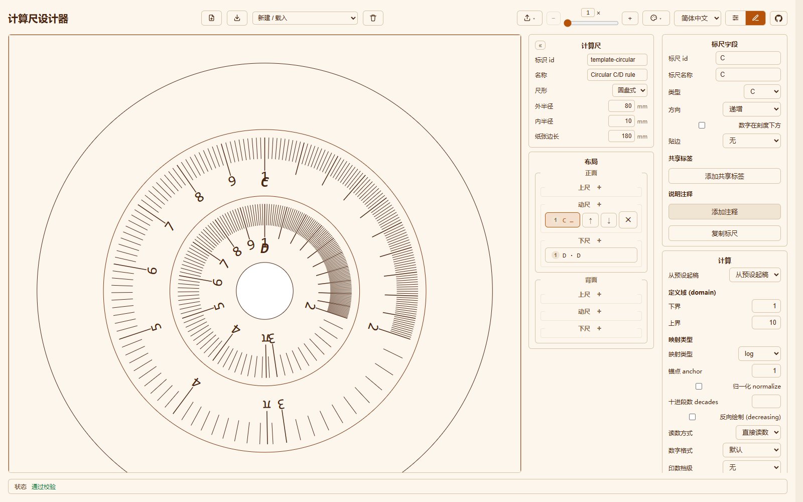

# 设计器

设计器用于构建计算尺，并通过与模拟器相同的渲染器进行预览。它是同一应用栏内的
整页视图。表单背后的数据结构见[数据模型](../dev/data-model.md)；预览所共用的
渲染、滑动与读数行为见[模拟器](simulator-cn.md)。

## 打开与关闭

使用应用栏的模拟器 / 设计器切换中的**设计器**按钮打开，用**模拟器**返回。顶栏的应用
功能（主题、语言、导出、帮助、显示比例）在模拟器与设计器两页一致。设计器把模拟器的
工具替换为创作控件，按此顺序排列：**新建**（文件图标）、**导入**（托盘图标）、
**新建 / 载入**下拉（含内置型号与起步模板两组）、**清除草稿**（垃圾桶图标）。每个图标
按钮都以悬浮提示显示其名称。顶栏的**导出**菜单除导出 JSON 外，还能把当前草稿打印出来。

离开设计器时，它的工作会保留为草稿。下次打开时会自动恢复草稿，并显示
**已恢复上次编辑的草稿**提示。**清除草稿**会丢弃草稿并从空规则开始。你的每一次
编辑都会随即写入草稿。

## 开始一条规则

**新建 / 载入**是单个菜单，含两组。**内置型号**会把内置型号（1002 或五七型）复制到
编辑器中，便于研究或改编；**起步模板**载入一个最小起点（**线性对数尺 (C/D/L)**或
**圆形 C/D 尺**）。**新建**从一条空线性规则开始（id 为 `new-rule`，一个空的尺面结构）。

两个起步模板都刻意做得很小：

- **线性对数尺 (C/D/L)**——直尺式规则，每个分区一行：上行一条 `A` 标尺，动尺上一条
  `C`，下行是 `D` 与线性 `L`。
- **圆形 C/D 尺**——`form: "circular"` 的规则，圆盘的动尺上一条 `C`，下尺一条 `D`。

## 表单

预览占据左侧，与模拟器一致（尺在左、读数在右）；表单在右侧，分两列。

- **第一列**始终可见，包含**计算尺**与**布局**面板。
- **第二列**在你选中或新增一条标尺后立即出现在其右侧，包含该标尺的**标尺字段**与
  **计算**面板。未选中标尺时只显示第一列，**布局**面板末尾提示**选中一条标尺**。

**计算尺**面板左上角的 **«** 控件会折叠整个表单，把宽度让给预览；预览右上角随即
出现 **»** 按钮，可重新展开表单。两种状态下应用栏里的规则工具都保持不变。

### 计算尺

**计算尺**面板保存型号元数据和尺寸。

- **标识 id**——规则的标识符。它写入 JSON，并构成导出文件名
  （`<id>.spec.json`、`<id>.rule.json`）。它不会印在尺上。
- **名称**——规则的显示名。打印草稿时用作标题，模拟器也以它列出导入的规则。
- **尺形**——**直尺式**或**圆盘式**。直尺式是带滑动中段的矩形规则；圆盘式是同心的
  圆盘规则。

切换尺形会改变所显示的尺寸。从直尺式选**圆盘式**时，若规则原本没有圆盘则创建一个
默认圆盘；切回**直尺式**会移除圆盘并重新显示线性物理字段。

#### 直尺式尺寸

**尺形**为**直尺式**时显示以下字段。长度单位为毫米；比例字段的取值是行高的分数。
下表默认值取自 1002（12 英寸 x 2 英寸的尺）。

| 字段 | 单位 | 含义 | 改动的影响 |
|---|---|---|---|
| **面宽** | mm | 尺面的长边 | 标尺绘制可用的水平空间（1002 为 304.8 mm） |
| **面高** | mm | 尺面的短边 | 所有行共用的垂直空间（1002 为 50.8 mm） |
| **上行数** | 行 | 上尺带的行数 | 上尺分区可容纳的标尺数 |
| **中行数** | 行 | 中尺带的行数 | 动尺（可移动的中段）可容纳的标尺数 |
| **下行数** | 行 | 下尺带的行数 | 下尺分区可容纳的标尺数 |
| **左栏** | mm | 左侧名称栏 | 每面左侧印刷的标尺名所占的宽度 |
| **右栏** | mm | 右侧参考栏 | 尺面右侧印读数备注所占的宽度 |
| **槽比例** | 比例 | 槽高 / 行高 | 分区之间的间隙 |
| **边距比例** | 比例 | 边距 / 行高 | 一行内部的垂直边距 |
| **数字比例** | 比例 | 数字高 / 行高 | 印刷数字的大小 |

行数决定能容纳多少条标尺，而不是标尺有多高：面高在计入的行之间分配（扣除槽和
边距），因此行数增加会让每行变矮，减少则会让每行变高。

#### 圆盘式尺寸

**尺形**为**圆盘式**时显示以下字段，全部以毫米计。

| 字段 | 含义 |
|---|---|
| **外半径** | 圆盘外缘（标尺绘制所限的边界圆） |
| **内半径** | 中心孔 / 转轴凸台 |
| **纸张边长** | 圆盘印在其上的正方形纸张的边长 |

三个值必须相容：外半径为正，内半径在 0（含）与外半径之间，纸张边长至少是外半径的
两倍，这样整个圆盘才装得进纸张。

### 布局

**布局**面板列出**正面**和**背面**各自的标尺，分为三个尺带：**上尺**、**动尺**和
**下尺**。**动尺**即可移动的中段。

每条标尺在其分区内编号，行显示为 `index. id · name`。

- 每个分区标题旁的 **+** 新增一条 C 标尺：当选中标尺就在该面的该分区时插到其后，
  否则追加到末尾；新标尺随即成为选中项。新标尺以 `C` 起步，带 log 1..10 的计算和
  一个分段。
- 点击标尺行即可选中。选中的行会显示**上移**、**下移**与红色 **✕** 删除按钮。上移
  下移会与同分区的相邻标尺互换位置；删除后选择被清除。
- 也可以在预览中点击标尺来选中它；鼠标悬停在预览中的标尺上会将其高亮，在尺面之外
  点击则清除选择。列表与预览保持同步。

### 标尺字段

选中标尺后，**标尺字段**面板编辑该标尺中不属于计算的部分：

- **标尺 id**和**标尺名称**——即布局行的两半。id 是数据结构中的标识；新增或复制的
  标尺会在其分区内获得唯一 id。名称是模拟器读数面板与型号信息中显示的标签。
- **类型**——渲染器已知的常规标尺类型（`C`、`D`、`A`、`B`、`K`、`L`、`CF`、`DF`、
  `CI`、`DI`，`LN` / `H` / `SH` / `TH` 各家族，`SIN2` / `COS2` / `TG2` / `CTG2` 等
  三角类型，以及五七型的 `S` / `ST` / `T`）。它标明标尺所属的家族；分度与读数行为
  则来自下面的计算。
- **方向**——**递增**或**递减（红色）**。递增标尺自左向右增大，印为黑色；递减标尺
  自左向右减小，印为红色。颜色由方向推导，不能单独设置；共享标签的颜色同样由其自身
  方向决定。
- **数字在刻度下方**——把数字印在刻度下方而非上方。
- **贴边**——当一条标尺与邻居共用一条基线时该怎么办：**无**按常规绘制，**顶边
  （roof）**让刻度挂在行的上边缘，**底边（floor）**让刻度从行的下边缘立起。它用于
  共线的相邻两条标尺：1002 上 `sh2` 行用底边、其邻居 `sh3` 用顶边（`tg2` 与 `tg3`
  同理），两条标尺的刻度因此在它们之间的线上相接。
- **共享标签**——印在标尺同一组分度上的额外带括号标签（例如红色的 `cos2` / `ctg2`
  互补角数字）。每个共享标签有 id、标签名、自己的方向（因而有自己的颜色）以及
  **角度格式**：**无**、**带度符号**或**裸数字**。共享标签没有自己的计算，它复用
  所在标尺的分度。
- **说明注释**——右侧的读数备注。一条注释是一组片段，每段是一段文本并可标记
  **红色**，因此备注可以混排黑色与红色文字。只有一段黑色文字的注释会以普通字符串
  保存。可以增删整条注释，也可以增删单个片段。
- **复制标尺**——复制选中的标尺并把副本插在其后，副本会获得唯一 id。选择仍留在原来
  那条标尺上。

### 计算

**计算**面板控制选中标尺如何分度和读数。这里的每个字段都属于标尺的计算，而不是
标尺本身。下文每一项的实操版——每种映射类型一个实例并配图——见
[设计器计算：实例详解](designer-calculations-cn.md)。

- **从预设起稿**——用所选映射类型的粗粒度计算替换整个计算：**log**、**linear**、
  **fn**、**valueFn** 或 **expr**。当前定义域会保留；其余内容（映射字段、分段、印数、
  记号、读数方式和数字格式）都被预设替换。它只是起点而非成品分度，之后你再细化分段。
- **定义域 (domain)**——**下界**与**上界**，即标尺覆盖的数值范围（C/D 为 1..10，
  sin2 为 5.5..90，等等）。

#### 映射类型

映射是把数值转成尺上位置的公式。各类型及其字段如下：

| `kind` | 字段 | 数值如何变成位置 |
|---|---|---|
| **log** | **锚点 anchor**、**归一化 normalize** | `position = log10(value / anchor)`。锚点移动原点，使折叠标尺可以向起点左侧延伸；**归一化 normalize** 把跨度重新缩放到 0..1。 |
| **linear** | （无） | 在定义域上成正比——即 `L` / `lg` 行。 |
| **fn** | **函数**（`ln`、`sin`、`tan`、`sinh`、`tanh`）、**起点 from** | `position = log10(fn(value) / from)`。先对数值取函数，再除以参考值 `from`。 |
| **valueFn** | **函数**（`cosh`、`sech`）、**起点 from** | 分度上标注的是印出来的 `cosh` / `sech` 值 `V`，但位置用的是其自变量：`cosh` 为 `log10(sqrt(V² − 1) / from)`，`sech` 为 `log10(sqrt(1 − V²) / from)`。这就是 `H2` / `H3`（cosh）与 `H'2`（sech）各行。 |
| **expr** | **正向表达式 position(x)**、**反演表达式 inverse(p)** | `position` 是正向公式 `p = f(x)`，必填；`inverse` 是可选的 `x = g(p)`。只接受字符串。反演留空时，加载器会在定义域上数值求解正向映射的反函数。安全的表达式语法见[表达式](../dev/expressions.md)。 |

切换映射类型会把映射重置为该类型的默认值，并丢弃属于旧类型的字段；定义域、分段、
印数和记号不受影响。例如切到 **expr** 时初始为 `log10(x)`。

- **十进段数 decades**——分段图案重复的次数，每重复一次沿十倍推进。一个 `1..10`
  的分段配合 **decades** 为 `2`，会分出 1..10 与 10..100。1002 的 `K` 用 3，`A` / `B`
  用 2；只画一个十进段时留空即可。
- **反向绘制 (decreasing)**——镜像分度，使数值自左向右减小。要与**方向：递减
  （红色）**一起设置，才是常规的递减标尺（如 `CI`、`DI`）。两个控件彼此独立：
  方向决定颜色，镜像决定几何。
- **读数方式**——如何从标尺读数。**直接读数**（空默认值）使用映射自身的反函数；
  **倒数**改读 `n / value`，系数 **n** 可填；镜像的 `ln*I` 家族用 1，`CIF` 用 10。
  读数与分度始终使用同一映射，因此两者绝不会不一致。

#### 数字格式

**数字格式**只控制印刷数字的文字，不移动任何刻度。各选项为：

| 选项 | 印刷样式 |
|---|---|
| **默认** | 整数直接印，其余最多两位小数且省略前导零（`5.5`、`.5`） |
| **折叠 (CF/DF)** | 折叠行去掉十位数字（`10` -> `1`，`33` -> `3.3`） |
| **线性分数 (L)** | 线性 `L` / `lg` 行的分数写法（`0` / `1`，`.1` .. `.9`） |
| **带度符号** | 角度带度符号（`5.5°`） |
| **裸角度** | 不带符号的裸角度（五七型 `S` / `T`） |
| **度 + 分** | 度与分（五七型 `ST`：`35'`、`1°30'`、`2°`） |
| **自变量 (sh/th)** | 小于 0.1 用三位小数，小于 1 用两位，其余一位（`.095`、`.1`、`1.5`） |
| **sech 零点 (.0)** | 零点印 `.0`，其余三位小数（`H'2` 行） |
| **固定小数位** | 最多保留旁边出现的**小数位**框设定的位数，并省略前导零 |

- **印数档级**——每个印刷数字作为刻度时按哪一档处理。空默认值把每个印数都当作主刻度
  （档级 1）；**1**、**2**、**3** 强制为该档级；**保持测量档级**让每个印数沿用其分段
  网格给出的档级。`sh2`、`sh3`、`th2` 各行使用**保持测量档级**。

#### 分段

一个分段是一段测量得到的分度网格；标尺的整张网格就是分段的列表。

- **from** / **to**——该段的数值边界。
- **步长**——每个步长由步长值和**档级**（1 = 主，2 = 中，3 = 细）组成。引擎会对各
  步长排序并先画最细的；当一个较粗步长落在较细步长的刻度上时，以较粗的档级为准，
  主刻度就是这样出现在细网格之中的。可以增删步长。
- **分段内印数**——在分段内额外印刷的数字，逐个以数值输入。它们只增加印刷数字，不
  增加步长。

用**添加分段**新增一个分段；新分段从当前定义域开始，只含一个单位步长。

#### 印数与记号

- **印数 (labels)**——一个印刷数字。填写**值**，可选填**文本**；纯数字按原样印刷，
  填了文本则印文本。清空文本后该条目又变回纯数字。
- **记号 (marks)**——一个额外的带标签点，不必落在分度网格上。每个记号有**值**与
  **标签**；勾选**无穷大 ∞** 可把它放在渐近线上而不是某个数值处（如 `th2` 的末端）。
  印数与记号会扩展标尺的印刷范围，因此放在映射定义域外一点点的值仍可读。

#### 共享计算

一条计算可以从标尺中抽出为一个命名条目，供多条标尺共享。在 JSON 中即
`spec.calculations: { "<name>": { ... } }`，标尺用
`"calculation": { "ref": "<name>" }` 指向它；生成器在构建成品规则时会把引用内联
回去。当你选中的标尺其计算是命名引用时，**计算**面板会说明：**该计算为命名引用
`<name>`，编辑将影响所有共享它的标尺。**此后你的每次编辑都写入这条共享计算，
所有指向它的标尺会一起改变。如果某条标尺指向了不存在的引用，面板会改为报告这一点。

内置型号和起步模板的计算都是内联的，因此不会共享；用生成器库创作的规则才可以。

## 实时预览

左侧的**预览**会在你编辑时根据当前规则重绘，并使用与模拟器相同的渲染器，因此预览
与模拟器一致。顶栏的**显示比例**控件（数字框 + 滑块，位于**导出**之后的第二项）会像
缩放模拟器的计算尺一样缩放预览。

设计器自身的界面元素位置固定——顶栏、表单与状态栏都不移动——**只有预览在其区域内滚动**。
因此当预览高于屏幕（大圆盘，或放大后）时，滚动的是预览本身，表单与状态栏始终可见。

在预览中点击标尺即可选中它，与在列表中点击其行完全一样；悬停会将其高亮，在尺面
之外点击则清除选择。

如果某次编辑使规则无效，预览会继续显示上次有效的计算尺，并提示
**预览为上次有效结果，当前规则未通过校验**。修复所报告的错误即可恢复实时更新。
缺少圆盘定义的圆形规则会显示提示而非预览。

## 校验状态

预览下方有一个状态栏，显示**状态**，后面是**通过校验**或一个显示
**N 个校验错误**的按钮。点击错误按钮会展开列表，每项给出路径、错误码和消息；有
问题的字段会在表单中标出。**已恢复上次编辑的草稿**提示也显示在这个状态栏里。

## 导出

设计器中的**导出**菜单有两个 JSON 项和一个打印项，规则未通过校验时三项都会禁用：

- **导出创作稿**写出 `<id>.spec.json`。这是创作稿，不是成品规则，也是日后要重新
  导入以继续编辑的文件。
- **导出计算尺定义**写出 `<id>.rule.json`。这是通过校验的 `RuleDefinition`，供
  模拟器和生成器使用。
- **打印 / PDF** 按 1:1（尺自身的毫米尺寸）通过模拟器的打印路径打印当前草稿，便于把
  设计打样到纸上。

## 导入

**导入**把创作稿或成品规则定义读回编辑器。带有 `schemaVersion` 的文件会被当作成品
规则定义并做相应转换；其他 JSON 对象则按创作稿处理。文件会写入表单，并由与任何其他
编辑相同的状态栏校验；JSON 语法错误或非对象文件会在表单上方的横幅中报告。

若要把成品规则载入模拟器，请见[导入与导出](import-export-cn.md)。

## 示例：改一条标尺的数字格式

下面用一个小而可见的改动，把抽象字段串起来。

1. 打开**新建 / 载入**，选择**内置型号 -> 1002 Vector Log-Log Double-Sided Slide
   Rule**。整个型号被复制进编辑器；预览会重绘所有带标尺的尺面。
2. 在**布局**中展开**正面**和**动尺**分区，点击行 `6. C · C`。该行高亮，右侧出现
   含**标尺字段**与**计算**的第二列。（预览中悬停会高亮标尺，点击预览里的标尺也能
   选中它。）
3. 在**计算**中找到**数字格式**，从**默认**改为**带度符号**。预览里 `C` 的数字从
   `1`、`1.1` …… `10` 变成 `1°`、`1.1°` …… `10°`。分度、`π` 记号和所有其他标尺
   都不变：数字格式只改写印刷文字。
4. 把**数字格式**改回**默认**即可恢复。

因为内置型号各标尺的计算是内联的，这里只有这条 `C` 标尺发生变化。如果该标尺用的是
命名计算引用，第 3 步会改写所有共享它的标尺的格式。
