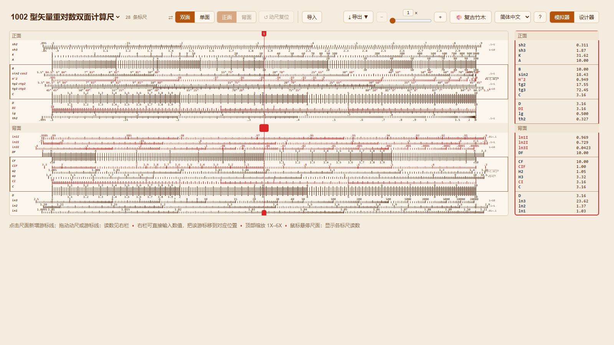

# 快速上手

SlideRule 1002 是中国 1002 型矢量重对数双面计算尺的网页模拟器，并在同一页面内置了
用于创作新计算尺的可视化设计器。取值方式与实体尺一致：通过滑动并对齐，再读取游标
下的刻度，而不是把算式敲进计算器。模拟器内置 1002、单面的五七型便携计算尺，以及
你导入的任何规则 JSON。



## 本地运行

需要 Node.js 20.19.4 或更高版本。

```bash
npm install
npm run dev
```

Vite 会为你打开 <http://localhost:3000>。GitHub Pages 部署定义在
`.github/workflows/deploy.yml` 中；推送到 `master` 或 `main` 会构建并发布站点。

## 布局

整个应用共用一条应用栏：

- **左侧（型号选择器）。** 当前型号名同时充当页面标题。展开它可在 1002、五七型和
  已导入的规则之间切换。它旁边的数字是该型号的标尺数量。
- **中部（计算尺工具）。** 显示方式切换（**双面** / **单面**）、尺面切换
  （**正面** / **背面**）、**动尺复位**按钮、缩放控件（**1X**–6X），以及
  **导入**按钮。
- **右侧（应用功能）。** 模拟器与设计器中相同：**主题**选择器、**语言**选择器、
  **导出**菜单、**?** 帮助按钮，以及**模拟器** / **设计器**切换。

栏下方，计算尺占据主区域左侧，读数面板位于右侧，每个游标一张卡片。两者下面各有
一行简短提示，列出基本手势。首次访问时会自动打开快速上手教程；之后随时可以从
**?** 对话框重新打开。

## 第一遍操作

1. **放置游标。** 在尺面任意处点击即可新增一条游标线。右侧读数面板会为它出现一张
   卡片。
2. **拖动动尺。** 按住中间区域（动尺）左右拖动。上下两条固定尺保持不动，动尺移动，
   读数面板中的数值随之变化。
3. **读取面板。** 每张卡片列出该游标处每条标尺的值。在某个读数中输入数值并按回车，
   即可把该游标移到读得该值的位置。

接下来请继续阅读[模拟器](simulator.md)页面，了解完整的控件。
